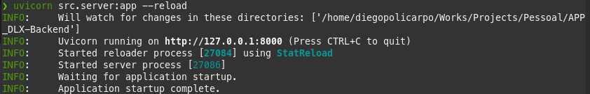

# APP DLX Backend

(BACKEND) APP para anúncio de vendas de produtos e serviços em cidade pequena. API REST desenvolvida em Python. 

## 🚀 Começando

Essas instruções permitirão que você obtenha uma cópia do projeto em operação na sua máquina local para fins de desenvolvimento e teste.

Consulte **Implantação** para saber como implantar o projeto.

---

## Ajustes e melhorias

O projeto ainda está em desenvolvimento e as próximas atualizações serão voltadas nas seguintes tarefas:

- [ ] Inserir autenticação em todas as rotas;
- [ ] README.md explicando todo o funcionamento da API;
- [ ] Filtros de busca nos endpoints, via query strings (por exemplo, filtro por nome dos produtos).
- [ ] Tratar e sanitizar a entrada e saída dos dados.
- [ ] Testar, de forma automatizada, o funcionamento do código;
- [ ] Criar um script/container para sua execução, facilitando a utilização local.
- [ ] Criar comandos para facilitar o desenvolvimento e a utilização do serviço local.
- [ ] Build automatizado do repositório usando alguma ferramenta de Continuous Integration.
- [ ] Garantir seus padrões e estilo de código de forma automatizada.
#
## 📋 Pré-requisitos

De que coisas você precisa para instalar o software e como instalá-lo?

```
Python v3.7
```
```
Visual Studio Code (opcional)
```
#

## Conteudo
API Rest desenvolvida para consumo ...
- 
- 
- 

Todas as rotas solicitam autenticação para ser consumidas, sendo a partir da criação de um usuário, gerando um token e o mesmo sendo validado, para assim ter o acesso aos endpoits.
#
## ⚙️ Implantação

Segue abaixo uma série de exemplos passo-a-passo que informam para ter um ambiente de desenvolvimento em execução.
- Lembrando que esse projeto foi desenvolvido no Linux, portanto, os comandos abaixo são relacioanados ao sistema operacional informado.
- Os passos abaixo devem ser executados com o terminal aberto na raiz do projeto:

1. Crie uma venv pelo terminal:
```
virtualenv venv
```
2. Ative a venv:
```
source venv/bin/activate
```
3. Instale o requirements.txt:
```
pip install -r requirements.txt
```
4. No terminal, execute o comando do uvicorn para subir a API:
```
uvicorn src.server:app --reload
```

#
## ⚙️ Executando os testes

Explicar como executar os testes automatizados para este sistema.

### 🔩 Analise os testes de ponta a ponta

Explique que eles verificam esses testes e porquê.

```
Dar exemplos
```
#
### ⌨️ Testes de estilo de codificação

Explique que eles verificam esses testes e porquê.

```
Dar exemplos
```
#
## 📦 Desenvolvimento

Adicione notas adicionais sobre como implantar isso em um sistema ativo

## 🛠️ Construído com

* [![Next][Next.js]][Next-url]
* [![React][React.js]][React-url]
* [![Vue][Vue.js]][Vue-url]
* [![Angular][Angular.io]][Angular-url]
* [![Svelte][Svelte.dev]][Svelte-url]
* [![Laravel][Laravel.com]][Laravel-url]
* [![Bootstrap][Bootstrap.com]][Bootstrap-url]
* [![JQuery][JQuery.com]][JQuery-url]

<p align="right">(<a href="#readme-top">back to top</a>)</p>

#

## ✒️ Autores

Mencione todos aqueles que ajudaram a levantar o projeto desde o seu início

* **Um desenvolvedor** - *Trabalho Inicial* - [umdesenvolvedor](https://github.com/linkParaPerfil)
* **Fulano De Tal** - *Documentação* - [fulanodetal](https://github.com/linkParaPerfil)

Você também pode ver a lista de todos os [colaboradores](https://github.com/usuario/projeto/colaboradores) que participaram deste projeto.
#
## 📄 Licença

Este projeto está sob a licença (sua licença) - veja o arquivo [LICENSE.md](https://github.com/usuario/projeto/licenca) para detalhes.

#
## 🎁 Expressões de gratidão

* Conte a outras pessoas sobre este projeto 📢
* Convide alguém da equipe para uma cerveja 🍺 
* Obrigado publicamente 🤓.
* etc.
---

<p align="right">(<a href="#readme-top">back to top</a>)</p>
